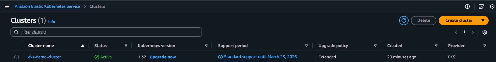
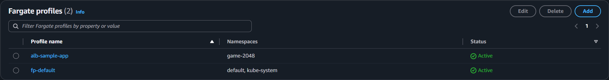
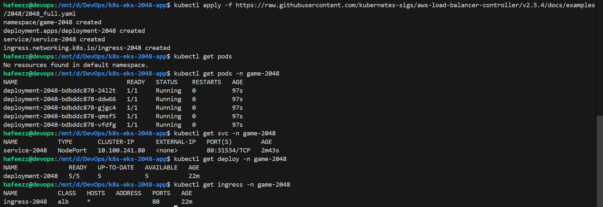
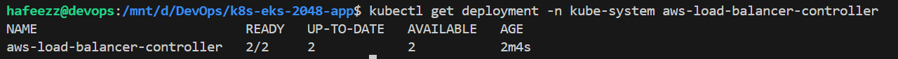
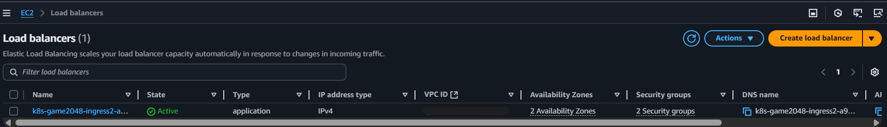
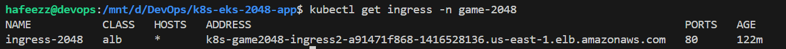
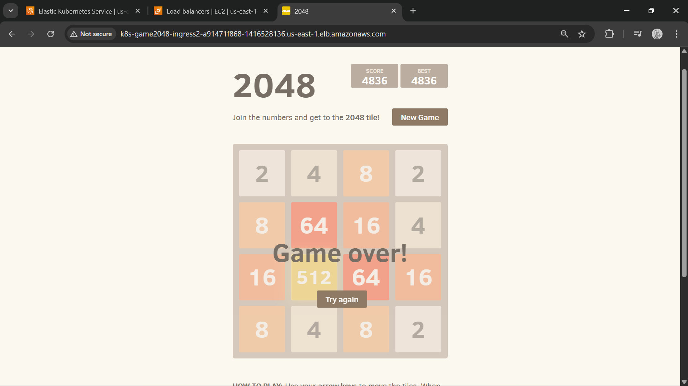

<h1 align="center"><strong>Kubernetes End-to-End Project on AWS EKS<br>Deploying the 2048 Game Application with Ingress</strong></h1>

⫸ Before we start creating EKS, there are few prerequisites that need to be installed on our laptop prior and make sure they are installed and updated, as to interact with EKS

### **🗒️ Prerequisites**

⫸ Firstly, we need to have `AWS CLI` installed, you can follow the steps from [AWS CLI Installation](https://github.com/hafeezzshs/devops-journey/blob/main/aws/aws_cli_setup_guide.md)

⫸ Next you need to have `kubectl` installed on your system, because using kubectl we interact with the K8s cluster that we are going to create. You can follow the steps from the official [Kubernetes documentation](https://kubernetes.io/docs/tasks/tools/)

```bash
# On Linux

# Download the latest version
curl -LO "https://dl.k8s.io/release/$(curl -L -s https://dl.k8s.io/release/stable.txt)/bin/linux/amd64/kubectl"

# Make the binary executable
sudo chmod +x kubectl

# Move the binary into your PATH:
# To make kubectl accessible system-wide, move it to /usr/local/bin
sudo mv kubectl /usr/local/bin/

# Verify your installation
kubectl version

# You'll see:
Client Version: v1.34.0
Kustomize Version: v5.7.1
Server Version: v1.33.1
``` 

⫸ And finally we need to have `eksctl` installed, go to the official [eksctl documentation](https://eksctl.io/installation/) and install the latest release

```bash
# On Linux

# for ARM systems, set ARCH to: `arm64`, `armv6` or `armv7`
ARCH=amd64
PLATFORM=$(uname -s)_$ARCH

curl -sLO "https://github.com/eksctl-io/eksctl/releases/latest/download/eksctl_$PLATFORM.tar.gz"

# (Optional) Verify checksum
curl -sL "https://github.com/eksctl-io/eksctl/releases/latest/download/eksctl_checksums.txt" | grep $PLATFORM | sha256sum --check

tar -xzf eksctl_$PLATFORM.tar.gz -C /tmp && rm eksctl_$PLATFORM.tar.gz

sudo install -m 0755 /tmp/eksctl /usr/local/bin && rm /tmp/eksctl

# Verify your installation
eksctl version

# You'll see:
0.214.0
```

⫸ Let's start creating the EKS cluster, if you create through AWS console we need to provide alot of parameters but usually in the organizations we don't follow this, one of the most preferred way to create EKS cluster is by using `eksctl`

⫸ Basically, `eksctl` is a command line utility that is used to manage EKS cluster, and don't forget to **delete** the cluster once your hands-on practise is done

```bash
# Create the cluster using Fargate
eksctl create cluster --name <your-cluster-name> --region <your-region> --fargate

#i.e.,
eksctl create cluster --name eks-demo-cluster --region us-east-1 --fargate

# Delete the cluster
eksctl delete cluster --name <your-cluster-name> --region <your-region> 

# i.e.,
eksctl delete cluster --name eks-demo-cluster --region us-east-1
```

⫸ Be patient as it takes long time to create EKS cluster

<p>

</p>

fargate profile

⫸ We need to update the kubeconfig file:

```bash
aws eks update-kubeconfig --name <your-cluster-name> --region <your-region>

# i.e.,
aws eks update-kubeconfig --name eks-demo-cluster --region us-east-1
```

⫸ Let's go with deployment of the application step-by-step:

First we'll try to deploy the 2048 deployment application using deployment

For that, let's create an Fargate profile:
```bash
# Creating fargate profile with custom namespace
eksctl create fargateprofile \
    --cluster <your-cluster-name> \
    --region <your-region> \
    --name alb-sample-app \
    --namespace game-2048

# i.e.,
eksctl create fargateprofile \
    --cluster eks-demo-cluster \
    --region us-east-1 \
    --name alb-sample-app \
    --namespace game-2048
```

<p>

</p>

⫸ Let's deploy the `deployment`, `service` and `ingress` YAML files all at a time using the [file](https://raw.githubusercontent.com/kubernetes-sigs/aws-load-balancer-controller/v2.5.4/docs/examples/2048/2048_full.yaml) which has all the configurations related **deployment**, **service**, and **ingress**:

```bash
kubectl apply -f https://raw.githubusercontent.com/kubernetes-sigs/aws-load-balancer-controller/v2.5.4/docs/examples/2048/2048_full.yaml
```

<p>

</p>

⫸ Remember that we haven't deployed `ingress controller` so far.

⫸ If you observe the `service` deployment there is no **EXTERNAL-IP** that means anybody within the AWS VPC or anybody who has access to the VPC can talk to these `pods` using the node IP address followed by port. But, our goal is to make someone outside the AWS (or) someone who is the user or customer should access.

⫸ And if you also observe `ingress` deployment there is no **ADDRESS** present because, we haven't deployed the `ingress controller` yet that means there is **no loadbalancer**. And this address is useful to access the application from the outside the world

⫸ Let's create the `ingress controller` which reads the ingress resource called `ingress-2048` and it will create a **LoadBalancer** for us, it not only just create the loadbalancer but it'll also configure the entire LoadBalancer such as: configure the `target group`, and configure the `port` on which we can access etc., everything it takes care by the `ingress controller` itself

⫸ As we are deploying the **ALB ingress controller** there is a prerequisite that we need to configure the OIDC connector (or) IAM OIDC provider, without this provider even though if we install the ALB ingress controller it will fail

⫸ The reason IAM OIDC provider is needed because, the ALB controller which is running it needs to access the application loadbalancer 

⫸ As ALB controller, controller is nothing but a K8s pod and this K8s pods needs to talk to the some AWS resources, and in order to talk to AWS resources it needs to have IAM integrated. So, that's why we need to create the IAM OIDC provider

⫸ Determine whether an IAM OIDC provider with your cluster’s issuer ID is already in your account. (or) follow the [official documentation](https://docs.aws.amazon.com/eks/latest/userguide/enable-iam-roles-for-service-accounts.html)

```bash
cluster_name=<your-cluster-name>
oidc_id=$(aws eks describe-cluster --name $cluster_name --query "cluster.identity.oidc.issuer" --output text | cut -d '/' -f 5)
echo $oidc_id
aws iam list-open-id-connect-providers | grep $oidc_id | cut -d "/" -f4
```

⫸ Create an IAM OIDC identity provider for your cluster with the following command.

```bash
# Creating and IAM OIDC provider
eksctl utils associate-iam-oidc-provider --cluster <your-cluster-name> --approve

# i.e.,
eksctl utils associate-iam-oidc-provider --cluster eks-demo-cluster --approve
```

⫸ Now, let's try to install Application LoadBalancer Controller on AWS, as any controller in K8s is just a `pod` , for this pod we are just granting the access to the AWS services such as API's for that first we need to create and IAM Role and grant access using IAM Policies. (or) follow the [official documentation](https://docs.aws.amazon.com/eks/latest/userguide/lbc-helm.html)

**Step 1: Create IAM Role using eksctl**
    
- Download an IAM policy for the AWS Load Balancer Controller that allows it to make calls to AWS APIs on your behalf.
    ```bash
    curl -O https://raw.githubusercontent.com/kubernetes-sigs/aws-load-balancer-controller/v2.13.3/docs/install/iam_policy.json
    ```

- Create an IAM policy using the policy downloaded in the previous step.
    ```bash
    aws iam create-policy \
    --policy-name AWSLoadBalancerControllerIAMPolicy \
    --policy-document file://iam_policy.json
    ```

- Replace the values for cluster name, region code, and account ID.
    ```bash
    eksctl create iamserviceaccount \
    --cluster=<cluster-name> \
    --namespace=kube-system \
    --name=aws-load-balancer-controller \
    --attach-policy-arn=arn:aws:iam::<AWS_ACCOUNT_ID>:policy/AWSLoadBalancerControllerIAMPolicy \
    --override-existing-serviceaccounts \
    --region <aws-region-code> \
    --approve
    ```

**Step 2: Install AWS Load Balancer Controller**

This Helm chart will create the actual controller and it will use the service account for running the pod
- Add the eks-charts Helm chart repository.
    ```bash
    helm repo add eks https://aws.github.io/eks-charts
    ```

- Update your local repo to make sure that you have the most recent charts.
    ```bash
    helm repo update eks
    ```

- Install the AWS Load Balancer Controller.
    ```bash
    helm install aws-load-balancer-controller eks/aws-load-balancer-controller -n kube-system \
    --set clusterName=<your-cluster-name> \
    --set serviceAccount.create=false \
    --set serviceAccount.name=aws-load-balancer-controller \
    --set region=<your-region> \
    --set vpcId=<your-vpc-id>   
    ```

**Step 3: Verify that the controller is installed**

- Verify that the controller is installed.
    ```bash
    kubectl get deployment -n kube-system aws-load-balancer-controller
    ```
    <p>
    
    </p>
 
⫸ This Loadbalancer controller will create two replicas one in each availability zone and it will continuously watch for the ingress resource and it'll create the ALB resources in two availability zones 

⫸ And if you check the ingress again, you find the address. And this address is the load balancer that the ingress controller has created watching this ingress resource 

<p>


</p>

👉 Here you go, we successfully deployed and we are able to acces the load balancer and from the load balancer we are getting the request too🔥🔥🔥 

<p>

</p>
